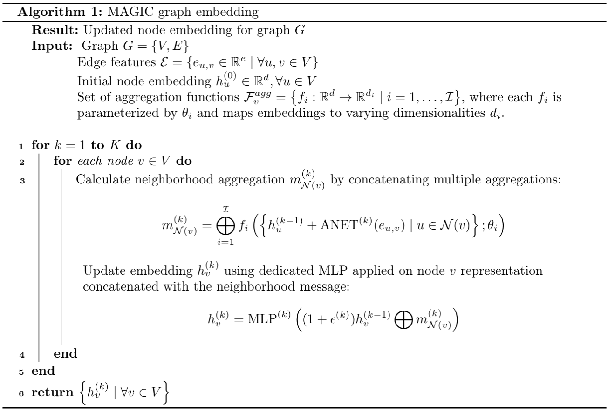

# Anti - Money Laundering MAGIC

This repository accompanies the research paper titled "**Money Laundering Detection with Multi-Aggregation Custom Edge GIN Networks**," which is currently under review.

From the paper's abstract:

> Detecting illicit transactions in Anti-Money Laundering (AML) systems remains a significant challenge due to class imbalances and the complexity of financial networks. This study introduces the Multiple Aggregations for Graph Isomorphism Networks with Custom Edges (MAGIC) convolution, an enhancement of the Graph Isomorphism Network (GIN) designed to improve the detection of illicit transactions in AML systems. MAGIC integrates edge convolution (GINE Conv) and multiple learnable aggregations, allowing for varied embedding sizes and increased generalization capabilities.

> Experiments were conducted using synthetic datasets, which simulate real-world transactions, following the experimental setup of previous studies to ensure comparability. MAGIC, when combined with XGBoost as a link predictor, outperformed existing models in 17 out of 24 metrics, with notable improvements in F1 scores and precision, particularly in datasets with strong class imbalances. In the most imbalanced dataset, MAGIC achieved an F1 score of 84.4% and a precision of 91.8% for the "illicit" class. While MAGIC demonstrated high precision, its recall in certain cases was lower than that of other models, indicating potential areas for future enhancement.

> Overall, MAGIC presents a robust approach to AML detection, particularly in scenarios where precision and overall quality are critical. Future research should focus on optimizing the model's recall, potentially by incorporating additional regularization techniques or advanced sampling methods. Additionally, exploring the integration of foundation models like GraphAny could further enhance the model's applicability in diverse AML environments.

# The study design and assumptions

A persistent challenge in Anti-Money Laundering research is the scarcity of standardized datasets for model comparison. This study builds upon the dataset and experimental protocol established by the following study:

> Silva, Í. D. G., Correia, L. H. A., & Maziero, E. G. (2023, May). Graph Neural Networks Applied to Money Laundering Detection in Intelligent Information Systems. In Proceedings of the XIX Brazilian Symposium on Information Systems (pp. 252-259).

The authors of this study developed a set of highly imbalanced synthetic datasets that simulate real-world transactions. The proposed model was tested using these datasets. The original implementation is accessible via the [the official GitLab repository](https://gitlab.com/italodellagarza/SBSITests).

This project employs the same datasets, train/test splits, and evaluation metrics to ensure the comparability of results and to rigorously evaluate the newly proposed model.

## The model

The proposed model is an extension of the Graph Isomorphism Networks (GIN), enhanced with custom edge convolution and multiple learnable aggregations. This model is referred to as the Multiple Aggregations for Graph Isomorphism Networks with Custom Edges (MAGIC).

The pseudocode for the model is as follows:




# Installation instructions

There are two primary methods for installing this project:

## Manual Installation

Ensure that Anaconda or Miniconda is installed.

Create a new conda environment using the provided environment.yml file:

```
conda env create -f environment.yaml
```

Activate the environment:

```
conda activate aml_magic
```

Install Poetry, the main package manager used in this project:

```
pip install poetry
```

Install the package along with all dependencies:

```
poetry install --with dev --with jupyter
```

To use the package, ensure the environment is activated.

# Running the experiments

## DVC pipeline

The experiments are managed using DVC. To run the experiments, execute the following command:

```
dvc repro
```

This will perform the following steps:
1. Download the raw data from the study by Silva et al.
2. Process the data to create the necessary datasets.
3. Train the GNN model and the accompanying link predictor.
4. Summarize the results.
5. Save the results to the MLFlow tracking server.
6. Generate a summary of the results and LaTeX tables.

## Check results

### In result files

**Only after you run the DVC pipeline**, you can check the reuslts directly in the result files.

1. Directory `results/study/` contains a separate folder for each dataset (e.g. `amlsim_31_CI_SUMMARY`) with two files inside:
   1. `DATASET_NAME_xgboost_raw.csv` - raw scores for each fold and metric for the XGBoost link predictor;
   2. `DATASET_NAME_xgboost.csv` - aggregates summary scores (mean, +/- std. deviation) for each metric after full cross-validation.
2. Directory `results/comparison/' contains the following files and folders:
   1. `scores_summary.csv` and `scores_summary.xlsx` - a comparison of the aggregated results for each model (including those from previous study) and metric. **Data from this file was used to report results in paper**.
   2. `DATASET_NAME_scores.tex` - LaTeX tables with aggregated results for each dataset and metric. **Code for this tables was used in the paper**.
   3. `figures/` - a folder with detailed comparison boxplots for each dataset, each metric and models (including those from previous study).


### In jupyter notebook

**Only after you run the DVC pipeline**, you can visualize the results in the Jupyter notebook:

```
notebooks/summarize_results.ipynb
```
This notebook allows you to visualize raw scores from each approach, as well as the aggregated results, confidence intervals, etc.

### In MLFlow

**Only after you run the DVC pipeline**, you can visualize the results in MLFlow:

```
mlflow ui
```

This will open the MLflow tracking server in your browser. You can view the results of each experiment, including the hyperparameters, metrics, and artifacts.

There are two types of experiments in MLFlow, varying by the naming convention:
1.  amlsim_**dateset name** - summarize CV results for each metric for the AML Magic model as a whole - providing the mean, std. deviation, and confidence interval after full cross-validation.
2. experiment_amlsim_**dataset_name** - provides details on each cv fold for two phases of model training:
   1. GNN embedding;
   2. XGBoost link prediction.
   Therefore number of records for each dataset is equal to the number of folds times 2.


# Technologies and tools

## Dependency Management
Dependencies for this project are managed using the Poetry package manager.

## Data Processing and Experiments
Data processing and experiment management are handled by DVC - Data Version Control, while experiment and model tracking are facilitated by MLFlow.

## Model Implementation
The model is implemented using the PyTorch Geometric library. The accompanying link predictor (classifier) module is implemented using the XGBoost library.

## Project Structure
The directory structure of the project is organized as follows:

```
├── params.yaml                         - Global experiment hyperparameters
├── dvc.yaml                            - Main configuration file for DVC
├── dvc.lock                            - DVC lock file
├── pyproject.toml                      - Poetry project file
├── environment.yaml                    - Conda environment file
├── setup_env.sh                        - Script for setting up the conda environment and installing the project
|
├── data                                - Managed by DVC; contains raw and processed data. Subfolders are created by DVC.
│   ├── raw                             - Raw data files, downloaded from the study by Silva et al.
│   ├── processed                       - Processed data files, created by the DVC pipeline
|   └── results                         - Experiment results, saved by MLFlow
|
├── notebooks                           - Directory containing a Jupyter notebook for checking experiment results
├── stage_params                        - Directory containing parameters for DVC pipeline stages
│   ├── prepare_data.yaml                - Parameters for the data preparation stage
│   ├── gnn_training.yaml                - Hyperparameters for GNN and its training stage
│   └── gb_training.yaml                 - Hyperparameters for the Gradient Boosting training stage
|
├── src                                 - Source code directory
│   ├── consts.py                       - Constants used in the project
│   ├── utils                           - Utility functions
│   │   └── configs.py                  - Utility configuration classes
│   ├── models                          - Modules related to model training
│   │   ├── magic.py                    - Main model implementation
│   │   ├── metrics.py                  - Metrics used in the experiments
│   │   └── training.py                 - Main training logic
│   ├── stages                          - DVC pipeline stages
│   │   ├── prepare_data.py             - Data preparation stage
│   │   ├── train_and_test_models.py    - Model training pipeline
│   │   └── summarize_results.py        - Building results summary
└── .github/workflows                   - GitHub Actions workflows for building and linting the project
```